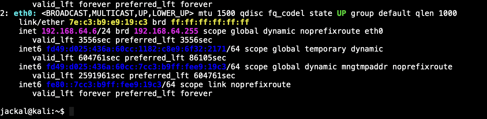

#  Packet Sniffer & Network Traffic Analysis

##  Overview
This project demonstrates packet-level visibility into network traffic using a controlled lab environment.  
Traffic was captured and analyzed using **tcpdump** and **tshark** on a headless Kali Linux system.

The goal of this project is to understand how network data flows, how metadata leaks occur, and how defenders analyze traffic in real-world SOC environments.

---

##  Lab Architecture

- **Kali Linux (Headless)** – Packet capture & analysis  
- **Ubuntu Linux** – Traffic generation  
- Isolated virtual network (internal traffic only)

### Network Interface Identification


---

##  Phase 1: ICMP Traffic Capture

Internal ICMP traffic was generated between Ubuntu and Kali to avoid NAT restrictions on external ICMP.

**Command used**
```bash
sudo tcpdump -i eth0 icmp

##  Phase 2: HTTP Plaintext Traffic Exposure

HTTP traffic was generated internally and captured to demonstrate how unencrypted protocols expose sensitive data in plaintext.

**Command used**
```bash
sudo tcpdump -i eth0 -A port 8080

##  Phase 3: DNS Query Capture

DNS traffic was captured to analyze metadata leakage such as queried domain names, request timing, and communication intent.

**Command used**
```bash
sudo tcpdump -i eth0 -nn -vv udp port 53

Phase 4: PCAP Creation (Forensic Artifact)
Captured traffic was saved into a PCAP file to enable offline forensic analysis and replay.
Command used
sudo tcpdump -i eth0 -w traffic.pcap
The generated PCAP file represents a defined capture window and is included in this repository as a forensic artifact.


Phase 5: PCAP Analysis Using tshark (Headless)
Since the analysis environment was headless, packet inspection was performed using tshark, the command-line engine of Wireshark commonly used in SOC and server environments.
Protocol Hierarchy Analysis
tshark -r traffic.pcap -z io,phs
This analysis confirms protocol distribution across Ethernet, IP, ICMP, UDP, and DNS layers, validating the nature of the captured traffic.
 Key Learnings
Packet sniffing provides visibility, not exploitation
Plaintext protocols expose sensitive metadata
DNS traffic leaks behavioral information even without payload inspection
Capture windows define the scope of forensic evidence
CLI-based traffic analysis is common in SOC and cloud environments
 Ethical Note
All traffic captures were performed in a private lab environment on systems owned and controlled by the author, strictly for educational and defensive purposes.
 Tools Used
tcpdump
tshark
Kali Linux (headless)
Ubuntu Linux


